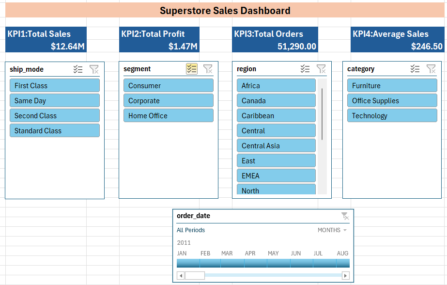
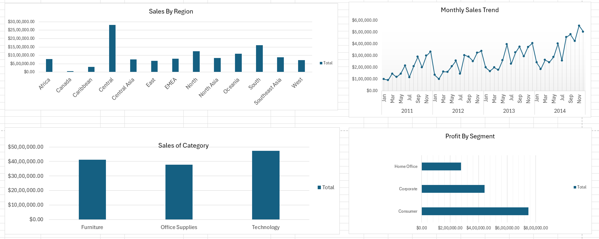
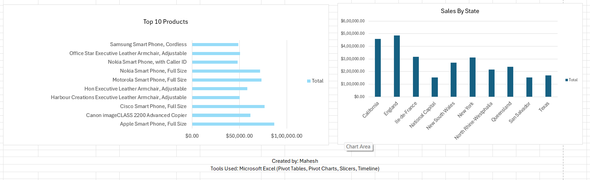

# 📊 Superstore Sales Dashboard (Excel)

## 📌 Project Overview

This project is an interactive **Sales Dashboard** built in **Microsoft Excel** using the Global Superstore Sales dataset. The dashboard provides insights into sales performance, profitability, customer segments, product performance, and regional trends through interactive visualizations.

The dashboard allows users to filter data dynamically using **Slicers** and a **Timeline**, making it easy to analyze sales from different perspectives.

---

## 🛠️ Tools & Features Used

- Microsoft Excel
- Data Cleaning
- Excel Tables
- Pivot Tables
- Pivot Charts
- Slicers
- Timeline
- KPI Cards
- Number Formatting
- Interactive Dashboard Design

---

## 📂 Dataset

**Dataset:** Superstore Sales Dataset

The dataset contains information about:

- Orders
- Customers
- Products
- Sales
- Profit
- Discounts
- Quantity
- Regions
- States
- Categories
- Segments
- Shipping Details

---

# 📷 Dashboard Preview

## Dashboard - Part 1



---

## Dashboard - Part 2



---

## Dashboard - Part 3



---

# 📈 Dashboard KPIs

- 💰 Total Sales
- 📈 Total Profit
- 📦 Total Orders
- 💵 Average Sales

---

# 📊 Dashboard Visualizations

- Sales by Region
- Sales by Category
- Profit by Segment
- Monthly Sales Trend
- Top 10 Products by Sales
- Sales by State
- Interactive Slicers
- Timeline Filter

---

# 🔍 Key Insights

- Technology category generated the highest sales.
- Consumer segment contributed significantly to overall revenue.
- Sales showed consistent growth over the years.
- A small number of products generated a large share of total sales.
- Sales performance varies significantly across different regions and states.
- Interactive filters allow users to quickly analyze different business scenarios.

---

# 📁 Repository Structure

```
excel-superstore-sales-dashboard/
│
├── images/
│   ├── dashboard1.png
│   ├── dashboard2.png
│   └── dashboard3.png
│
├── Superstore_Sales_Dashboard.xlsx
├── Superstore.csv
├── README.md
└── LICENSE
```

---

# 🚀 How to Use

1. Download the repository.
2. Open `Superstore_Sales_Dashboard.xlsx` in Microsoft Excel.
3. Navigate to the **Dashboard** sheet.
4. Use the slicers and timeline to interact with the dashboard.
5. Explore sales and profit trends across different dimensions.

---

# 🎯 Skills Demonstrated

- Data Cleaning
- Data Preparation
- Data Analysis
- Dashboard Design
- Business Intelligence
- Data Visualization
- Excel Automation
- Analytical Thinking

---

# 👨‍💻 Author

**Mahesh**

GitHub: https://github.com/maheshairborne

---

## ⭐ If you found this project helpful, consider giving it a star!